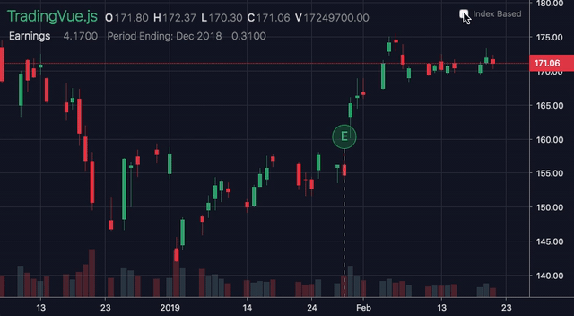

# Index-based mode

By default TVJS uses time as the x-coordinate. For candlestick charts like BTCUSD this works well, because there are no time gaps & every candle has a unique timestamp. But if you try to plot stocks data or build Renko charts, you'll see the weekend gaps, or a total mess in the second case.

The solution is to use the candle index instead of time, so the gaps are collapsed and Renko candles are placed at the same distance.

<br>
<center>



</center>
<br>


## In-Depth explanation

When you set `indexBased: true` in the data or in the main component props, the lib replaces time with the index internally. To make some sense of this situation a special TI mapping (time-index) is used. The `ti_map` object converts time and indices back & forth.

If you need to access the map from outside it can be done with the following code:

```js
// tvjs === the main component
// Converts index => time
tvjs.$refs.chart.ti_map.i2t(index)

// You guessed it right
tvjs.$refs.chart.ti_map.t2i(time)

// If x < 4294967296 (Max array length)
//  it returns index
// else
//  it converts x to index
tvjs.$refs.chart.ti_map.smth2i(x)
```

Inside overlay you'll find it in the `layout` [object](https://github.com/tvjsx/trading-vue-js/tree/master/docs/api#layout-object).

## 3 MODES of index calculation for overlays/subcharts

There 3 ways the library can calculate indices for overlays (form the main chart data):

```js
{
    "type": "Spline",
    "data": [...],
    "indexSrc": "<mode>"
}
```

* **map** -> uses TI mapping functions to detect the index (slowest, for stocks only. DEFAULT). It uses  interpolation/extrapolation, so it can correctly calculate data points placed in-between candles. It's all good but the math is quite heavy.

* **calc** -> calculates a shift between sub & data (faster, but overlay data should be perfectly align with the main chart, 1-1 candle/data point. Supports Renko).

  This method matches the timestamps between the main chart and the overlay, detecting the shift between index spaces (`*` means data timestamp):

`Main data: [ * * * * * * * * * * * * * ]`
`Overlayzz: [ <shift> * * * * * * * * * ]`

Sadly, it doesn't support scenerios like this one:

`Main data: [ * * * * * * * * * * * * * ]`
`Overlayzz: [ <shft> * * * * * * * * * ]`

* **data** -> overlay data should come with candle indices (fastest, supports Renko).


Using the first two you provide the overlay data as usual with timestamps:

```js
[
    [1543572000000, 4079.63],
    [1543575600000, 4076.08],
    [1543579200000, 4074.51],
    [1543582800000, 4073.33],
    [1543586400000, 4072.3]
]
```

For the third you should use the candle index instead (the index of the nearest candle to a corresponding data-point):

```js
[
    [3, 4079.63],
    [4, 4076.08],
    [5, 4074.51],
    [6, 4073.33],
    [7, 4072.3]
]
```

For almost all scenarios it's recommended to just feed a ready-to-use candle index. It requires a bit of data preprocessing, but it's the fastest method that supports all the good stuff, even fractional indices:

```js
[
    [3.5, 4079.63],
    [4.0, 4076.08],
    [4.5, 4074.51],
    [5.0, 4073.33],
    [5.5, 4072.3]
]
```
