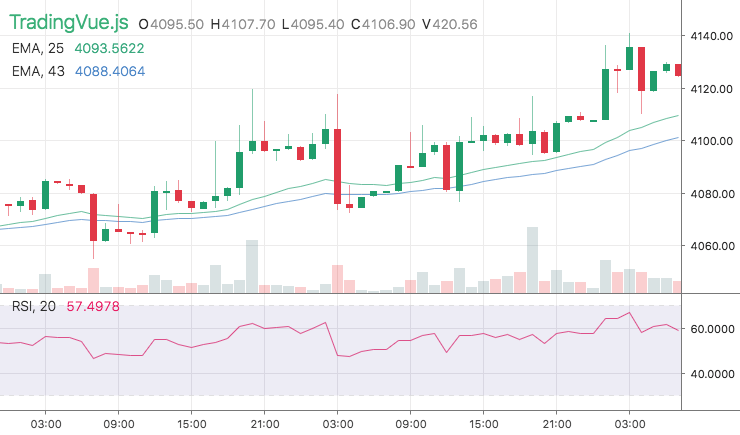
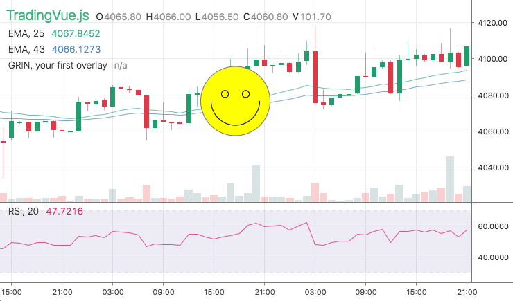
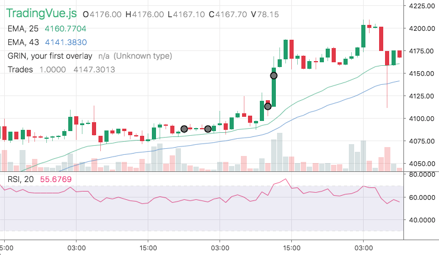
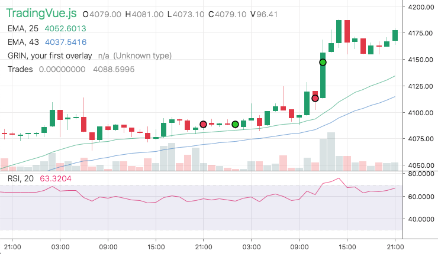
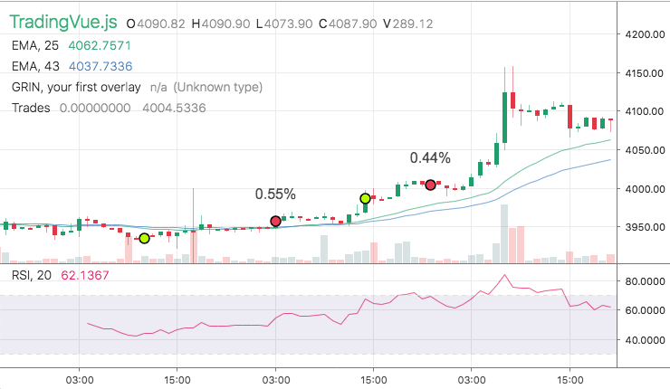

# Getting Started

::: warning
This library is in alpha stage, API may change. This guide's version is **0.6.1**
:::


**TradingVue.js** is a hackable charting lib for traders, highly inspired by UX of TradingView.com. It allows you to create custom indicators and even new types of charts.

## Who is this project for?

This project created for algo-traders, data-driven investors and fund managers who value innovative approaches to market research. We all know that datasets become more and more complex and the old indicators, such RSI, Stochastics and trendlines cannot provide a strong edge.

The solution is to dive deeper into unusual datasets, mix them together, apply new indicators and represent the results on precise and responsive charts.

## Installation

**TradingVue.js** is built with Vue.js, which makes it easy to use and extend.

**NPM (preferred)**

To use this library, you will need:

```
nodejs ^8.9.3
vue ^2.6.8
```

After installation node environment (all instructions at https://nodejs.org/) you can create a new project and then install all dependencies in one command:

```bash
npm i vue trading-vue-js
```

**BROWSER**

If you want to use your chart (later) on your site, include this script in your html page:

```html
<script src="trading-vue.min.js"></script>
```

## Your first chart

Let's simplify the whole process and start with 101 project. This project has all we need: the development environment, an overlay example and some data.

If you have `git` on your machine, create an empty folder and run:

```bash
git clone https://github.com/C451/trading-vue-101.git
```

Or just download the package and unpack it somewhere: [Download](https://github.com/C451/trading-vue-101/archive/master.zip)

Open a new terminal in the destination directory and install the project:

```bash
npm install
```

Among other things, you will find the following folders:

* **data** - contains our dataset in .json format
* **src** - our main focus will be here
* **tools** - tools for generating datasets

`src` folder contains:

* **App.vue** - VueJs app (our main file)
* **main.js** -  app entry point,
* **index.html** - simple html wrapper
* **Grin.js** -  example of simple overlay

Now we are ready to see it in action. Run in terminal:

```bash
npm run dev
```

And we are live on http://localhost:8080 !



## Adding custom overlay

### App.vue

Open `App.vue` in your favorite text editor. The code should look like this:

```html
<template>
<!-- TradingVueJs 101 (example from 'Getting Started' ) -->

<trading-vue :data="chart" :width="this.width" :height="this.height"
    :color-back="colors.colorBack"
    :color-grid="colors.colorGrid"
    :color-text="colors.colorText">
</trading-vue>
</template>

<script>
import TradingVue from 'trading-vue-js'
import Data from '../data/data.json'

export default {
    name: 'app',
    components: { TradingVue },
    methods: {
        onResize(event) {
            this.width = window.innerWidth
            this.height = window.innerHeight
        }
    },
    mounted() {
        window.addEventListener('resize', this.onResize)
    },
    beforeDestroy() {
        window.removeEventListener('resize', this.onResize)
    },
    data() {
        return {
            chart: Data,
            width: window.innerWidth,
            height: window.innerHeight,
            colors: {
                colorBack: '#fff',
                colorGrid: '#eee',
                colorText: '#333',
            }
        }
    }
}
</script>
```

As you can see, at the top there is **trading-vue** component, which have a bunch of properties, such as

* **data** - your data set in the specific format (see [Data Format](https://github.com/C451/trading-vue-js/tree/master/docs/api#data-structure))
* **width** - full chart width in px
* **height** - full chart height in px
* **color-xxxx** - custom colors for some elements

*You can find full description of the props in the [API book](https://github.com/C451/trading-vue-js/tree/master/docs/api#api-book)*.

### Using existing overlay class

Add `overlays` property to the trading-vue component, which contains an array (we will define it later):

```html
<template>
<!-- TradingVueJs 101 (example from 'Getting Started' ) -->

<trading-vue :data="chart" :width="this.width" :height="this.height"
    :overlays="overlays"
    :color-back="colors.colorBack"
    :color-grid="colors.colorGrid"
    :color-text="colors.colorText">
</trading-vue>
</template>
...
```

Then you can import an overlay file, in our case this will be `Grin.js`:

```js
...
import TradingVue from 'trading-vue-js'
import Data from '../data/data.json'
import Grin from './Grin.js' // New import
...
```

And finally, let's add an array of overlays, which includes `Grin` class to the app's data:

```js
...
data() {
    return {
        chart: Data,
        width: window.innerWidth,
        height: window.innerHeight,
        colors: {
            colorBack: '#fff',
            colorGrid: '#eee',
            colorText: '#333',
        },
        overlays: [Grin]
    }
}
```

Return to http://localhost:8080 and you will see the power of **Data -> Screen Mapping**!

<details><summary>Spoiler</summary>
<p>



</p>
</details>

## Going deeper: useful overlay

The indicator from the previous section does absolutely nothing - it's static and doesn't use any specific data. What if we, let's say, have a bunch of great trades and want to show them on our chart?

We need a new overlay class.

### Creating new class

Our data-object will have the following format:
```js
{
    "name": "Trades",
    "type": "PerfectTrades",
    "data": [
        [
            1552280400000, // timestamp (then trade occured)
            1,             // state: 0 = idle, 1 = long
            3973.0         // filled price
        ],
        [
            1552694400000,
            0,
            4011.0
        ],
        [
            1552701600000, // This is our buy
            1,
            4038.0
        ],
        [
            1552712400000, // And this is obviously a sell
            0,
            4124.0
        ]
    ],
    "settings": {}
}
```

We could make a much more complicated structure of **data**, but in this tutorial we are trying to keep things simple.

*The main idea behind the library is to give You the freedom to choose your favorite data formats.*

You should include at least four fields in your data object:
* **name** - (string) Name of the indicator (e.g., "EMA, 25")
* **type** - (string) Unique id for the indicator
* **data** - (2d array) Data array of time-stamped values `[timestamp, ...]`
* **settings** - (object) contains an info how to draw the indicator. Also can contain static data.

Now we are ready to create a new empty overlay:

```js
import { Overlay } from 'trading-vue-js'

export default {
    name: 'PerfectTrades',
    mixins: [Overlay],
    methods: {
        draw(ctx) { },
        use_for() { return ['PerfectTrades'] }
    }
}
```

Save it as `PerfectTrades.js`. And then add it to **App.vue** following the same process as for **Grin.js**:

```js
...
import Grin from './Grin.js'
import PerfectTrades from './PerfectTrades.js'
...
{
    ...
    overlays: [PerfectTrades]
}
...
```

*PerfectTrades is now defined and there is no "Unknown type" warning.*

### Custom draw() method

#### Lib's core philosophy

The core philosophy is **Data -> Screen Mapping (DSM)**. The library provides you with functions that map your data (it could be anything) to screen coordinates. The lib does all the dirty work behind the scenes: scrolling, scaling, reactivity, etc.

```js
layout.t2screen(t) // time -> x
layout.$2screen($) // price -> y
layout.t_magnet(t) // time -> nearest candle x
layout.screen2$(y) // y -> price
layout.screen2t(x) // x -> time
```
Thus, you need only to draw the elements of your indicator with standard canvas methods. You also can use any third party framework which works with the canvas API.

#### Simple trade markers

Let's draw simple trade points first. Because each data point contains time (`p[0]`) and price (`p[2]`) we will use two mapping functions:

```js
layout.t2screen(t) // time -> x
layout.$2screen($) // price -> y
```

```js
...
draw(ctx) {
    let layout = this.$props.layout // Layout object (see API BOOK)
    ctx.lineWidth = 1.5
    ctx.strokeStyle = 'black'
    for (var p of this.$props.data) {
        ctx.fillStyle = 'gray'
        ctx.beginPath()
        let x = layout.t2screen(p[0]) // x - Mapping
        let y = layout.$2screen(p[2]) // y - Mapping
        ctx.arc(x, y, 5.5, 0, Math.PI * 2, true) // Trade point
        ctx.fill()
        ctx.stroke()
    }
},
...
```


<details><summary>Result</summary>
<p>



</p>
</details>


#### Trade markers with color

We have one more data field: the trade type (`p[1]`). So we can switch the color:

```js
...
draw(ctx) {
    let layout = this.$props.layout // Layout object (see API BOOK)
    ctx.lineWidth = 1.5
    ctx.strokeStyle = 'black'
    for (var p of this.$props.data) {
        ctx.fillStyle = p[1] ? '#bfff00' : '#ec4662'
        ctx.beginPath()
        let x = layout.t2screen(p[0]) // x - Mapping
        let y = layout.$2screen(p[2]) // y - Mapping
        ctx.arc(x, y, 5.5, 0, Math.PI * 2, true) // Trade point
        ctx.fill()
        ctx.stroke()
    }
},
...
```
<details><summary>Result</summary>
<p>



</p>
</details>

#### Trade markers with labels

Finally, let's add a trade profit label above the marker:

```js
...
draw(ctx) {
    let layout = this.$props.layout // Layout object (see API BOOK)
    ctx.lineWidth = 1.5
    ctx.strokeStyle = 'black'
    for (var i in this.$props.data) {

        let p = this.$props.data[i]

        // We use previos point here, but the profit should
        // be already in the data (in a real usecase)
        let prev = this.$props.data[i - 1]

        ctx.fillStyle = p[1] ? '#bfff00' : '#ec4662'
        ctx.beginPath()
        let x = layout.t2screen(p[0]) // x - Mapping
        let y = layout.$2screen(p[2]) // y - Mapping
        ctx.arc(x, y, 5.5, 0, Math.PI * 2, true) // Trade point
        ctx.fill()
        ctx.stroke()

        // If this is a SELL, draw the profit label
        if (p[1] === 0 && prev) {
            let profit = p[2] / prev[2] - 1
            profit = (profit * 100).toFixed(2) + '%'
            ctx.fillStyle = '#555'
            ctx.font = '16px Arial'
            ctx.textAlign = 'center'
            ctx.fillText(profit , x, y - 25)
        }
    }
},
...
```

<details><summary>Result</summary>
<p>



</p>
</details>

### Custom overlay settings

To make the overlay more reusable we can define `settings` format and use its properties to customize the style (or behaviour):

`In data.json:`
```json
"settings" : {
    "buyColor": "#bfff00",
    "sellColor": "#ec4662",
    "markerSize": 5,
    "showLabel": true
}
```

The full code of "ready-to-use" overlay:

```js
import { Overlay } from 'trading-vue-js'

export default {
    name: 'PerfectTrades',
    mixins: [Overlay],
    methods: {
        draw(ctx) {
            let layout = this.$props.layout // Layout object (see API BOOK)
            ctx.lineWidth = 1.5
            ctx.strokeStyle = 'black'
            for (var i in this.$props.data) {

                let p = this.$props.data[i]

                // We use previos point here, but the profit should
                // be already in the data (in a real usecase)
                let prev = this.$props.data[i - 1]

                ctx.fillStyle = p[1] ? this.buy_color : this.sell_color
                ctx.beginPath()
                let x = layout.t2screen(p[0]) // x - Mapping
                let y = layout.$2screen(p[2]) // y - Mapping
                ctx.arc(x, y, this.marker_size + 0.5, 0, Math.PI * 2, true)
                ctx.fill()
                ctx.stroke()

                // If this is a SELL, draw the profit
                if (this.show_label && p[1] === 0 && prev) {
                    let profit = p[2] / prev[2] - 1
                    profit = (profit * 100).toFixed(2) + '%'
                    ctx.fillStyle = '#555'
                    ctx.font = '16px Arial'
                    ctx.textAlign = 'center'
                    ctx.fillText(profit , x, y - 25)
                }
            }
        },
        use_for() { return ['PerfectTrades'] }
    },
    // Define internal setting & constants here
    computed: {
        sett() { // Just an alias
            return this.$props.settings
        },
        buy_color() {
            return this.sett['buyColor'] || '#bfff00' // default value
        },
        sell_color() {
            return this.sett['sellColor'] || '#ec4662'
        },
        marker_size() {
            return this.sett['markerSize'] || 5
        },
        show_label() {
            return this.sett['showLabel'] !== false
        }
    }
}
```

## Publishing your overlay

Make sure your class contains `meta_info()` method at the same level as `use_for()`:

```js
meta_info() {
    return {
        author: 'Satoshi Smith',
        version: '1.0.0',
        desc: /*opt*/ 'Brief description',
        contact: /*opt*/ '<email>',
        github: /*opt*/ '<GitHub Page>'
    }
},
use_for() {return ['<YourOverlayId>'] }
```

Submit a PR to `https://github.com/tvjsx/tvjs-overlays` 


*This section will be updated*
